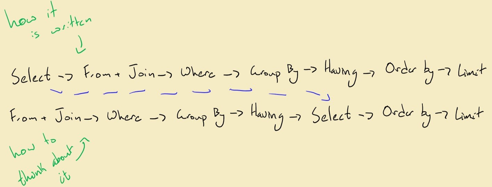

# SQL

One common problem *I* encounter with SQL is learning how to formulate effective queries. This is because the way a query is written isn't the proper way to think about it.

SQL Queries are not written in a way that makes a lot of intuitive sense: 

  

## Writing Queries
* *Select*: Used to fetch data
* *From*: What table to fetch from
* *Join*: Joins tables based on conditions
* *Where*: Used to filter records by specific condition
* *Group By*: Groups rows that have the same values into summary rows; often used with aggregate functions
* *Having*: Used instead of where for aggregate functions
* *Order By*: Used to sort the result in ascending or descending order
* *Limit*: Used to limit the number of records returned
* *Offset*: Used to skip a certain number of records returned

## Variables
Variables must be declared with the DECLARE statement and the data type. Value is optional.
```
DECLARE VARIABLE AS DATA_TYPE = VALUE
```

## Functions
User defined functions enable you to store complex code in one reusable structure. Functions MUST return a value. It compiles and executes every time it is called. 
```
CREATE FUNCTION [database_name.]function_name (parameters)
RETURNS data_type AS
BEGIN
    SQL statements
    RETURN value
END;
```

## Stored Procedure
Another way to store code into a reusable structure. Can take parameters if necessary and does not need to return a value. It is compiled once and executes every time it is called. 
```
CREATE PROCEDURE GetProductDesc_withparameters
(@PID INT)
AS
BEGIN
SET NOCOUNT ON
 
SELECT P.ProductID,P.ProductName,PD.ProductDescription  FROM 
Product P
INNER JOIN ProductDescription PD ON P.ProductID=PD.ProductID
WHERE P.ProductID=@PID
 
END
```

## Triggers
These are a special kind of stored procedure which 'reacts' to certain actions that occur in the database. They always perform an action is some event occurs. 
Three types:

* DML (data manipulation language) triggers – We’ve already mentioned them, and they react to DML commands. These are – INSERT, UPDATE, and DELETE. These are the most common
* DDL (data definition language) triggers – As expected, triggers of this type shall react to DDL commands like – CREATE, ALTER, and DROP
* Logon triggers – The name says it all. This type reacts to LOGON events

```
CREATE TRIGGER [schema_name.]trigger_name
ON table_name
{FOR | AFTER | INSTEAD OF} {[INSERT] [,] [UPDATE] [,] [DELETE]}
AS
{sql_statements}
```